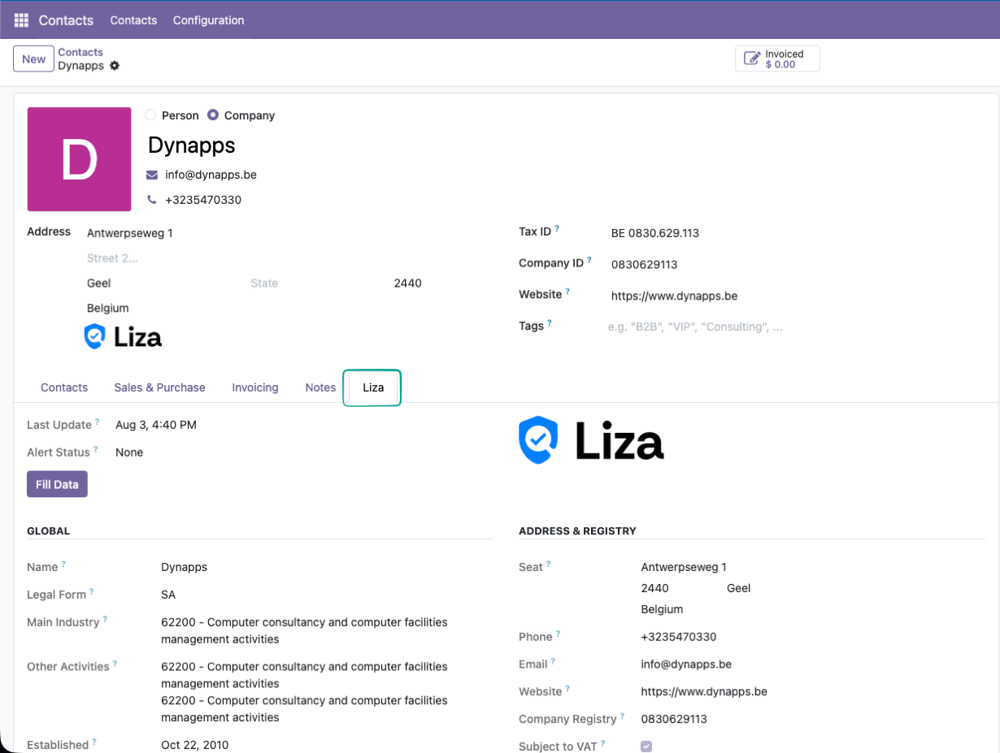

### Know exactly who you're doing business with

[Liza for Odoo](https://www.liza.nl) brings accurate, up-to-date and reliable
business information on **Dutch, Belgian, Luxembourg and French** companies
straight into your Odoo contacts. Assess the financial health, payment capacity
and stability of your customers, prospects and suppliers — without ever leaving
Odoo.

### Enrich contacts in one click

Create a contact by company name, VAT or registration number, or enrich an
existing one with a single click on the **Liza** button. Name, legal form,
address, activities and identifiers are filled in automatically — no more manual
lookups or copy-paste mistakes.

### Assess financial health at a glance

Every enriched contact gets a dedicated **Liza** tab with the key risk
indicators: company status, the Liza health barometer, credit limit, financial
warnings and the latest annual-account figures (equity, turnover, staff,
profit/loss).

### Stay up to date with Alerts

Add contacts to the Liza **Alerts** service and their data is kept in sync
automatically. Never miss a change of address, a lower credit limit or a new
financial warning again.

### Coverage

Reliable company information for **the Netherlands, Belgium, Luxembourg and
France**. Which data is available depends on your Liza subscription.

### What this module does — and does not do

**Liza Business Information** is the base module. It only *reads* data from Liza
and shows it on your contacts:

- **Included:** contact creation and enrichment, company identification and
  address, activities, company status, health barometer, credit limit, financial
  warnings, annual accounts, the Alerts synchronisation service, and viewing a
  company's payment experience where Liza has it.
- **Not included:** sharing any of *your* data with Liza. This module only
  retrieves information — it never sends your invoices or customer data.

### Want to share payment experience too?

A company's payment experience — how quickly it pays its suppliers — gets richer
as more Odoo users contribute. The optional **Liza Payment Information** module
builds on top of this one: it automatically sends your open customer invoices to
Liza so your payment behaviour feeds the shared dataset that everyone, including
you, benefits from right here on the Liza tab.
